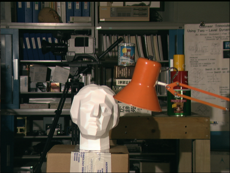
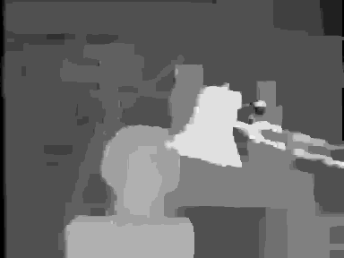

# Loopy Belief Propagation for Stereo Matching
A C++ implementation of Loopy Belief Propagation for stereo matching. Is used the "min-sum" variation of the algorithm and the "Accelerated" message update schedule.

## Input Image
The Tsukuba stereo image that used as input.

   

## Output Image
The disparity map that created at the output.

   

