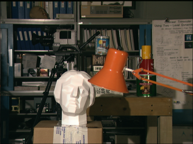
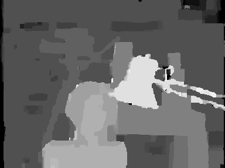
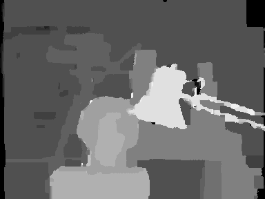
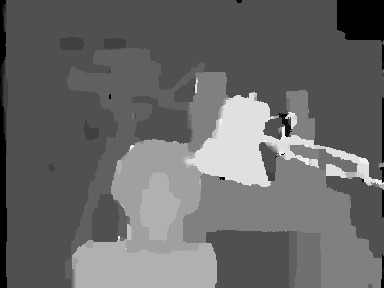
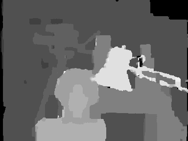
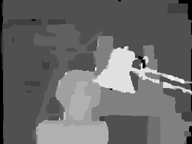

# Loopy Belief Propagation for Stereo Matching
A C++ implementation of Loopy Belief Propagation for stereo matching, featuring six alternative message update schedules to analyze convergence behavior and solution quality.

## Input Image
The Tsukuba stereo image that used as input.

 

## Output Image
The disparity maps that created at the output.

### Belief Propagation (Synchronous)

### Belief Propagation (Bipartite)

### Belief Propagation (Accelerated)

### Belief Propagation (Accelerated2)

### Belief Propagation (ByRow)

### Belief Propagation (ByRow2)

